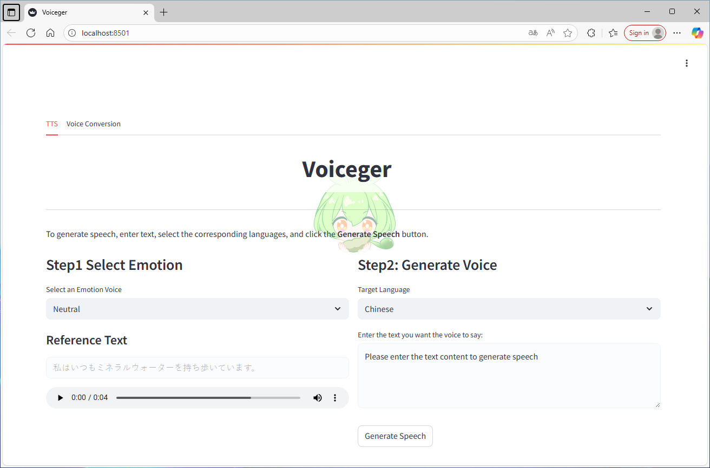
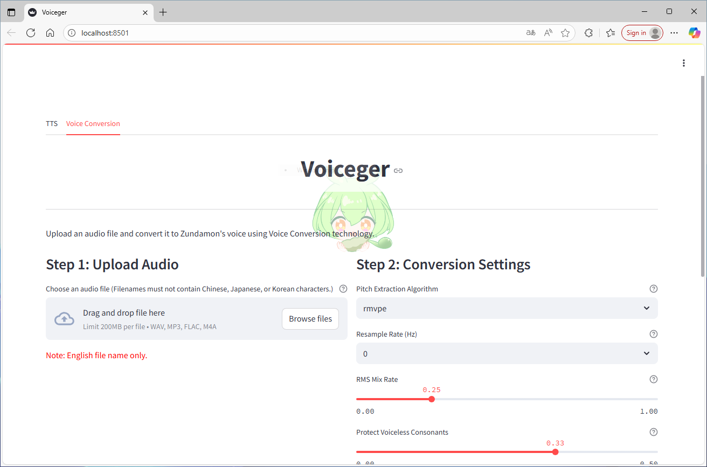

# Voiceger WebUI

This repository provides an official trial version of the **Voiceger WebUI**. It includes both **Zundamon TTS audio generation** and **Zundamon Voice Conversion** in a single Streamlit-based interface.

Official website: https://zunko.jp/

## Overview

This project is based on [GPT-SoVITS](https://github.com/RVC-Boss/GPT-SoVITS) and [RVC WebUI](https://github.com/RVC-Project/Retrieval-based-Voice-Conversion-WebUI) and has been adapted and fine-tuned for Zundamon's voice synthesis. The WebUI for inference is built using Streamlit, providing a user-friendly interface for generating Zundamon's speech audio files.

## Features

1. Unified Streamlit WebUI for both TTS (GPT-SoVITS) and Voice Conversion (RVC).
2. Emotion/style presets for TTS: select a Zundamon emotion, enter text, and generate audio; multilingual input is supported.
3. Bundled Zundamon models: GPT and SoVITS weights auto-loaded for high-quality synthesis.
4. Integrated RVC: convert vocals-only input to Zundamon’s voice.

## Prerequisites

Before starting, ensure you have the required dependencies installed:

```bash
pip install -r requirements.txt
```
- Notice: This app integrates two upstream projects (GPT-SoVITS for TTS and RVC-WebUI for Voice Conversion). You can also refer to the original environment setup guides.

After installing the dependencies, install PyTorch and its companion packages. Both `torchvision` and `torchaudio` are required.

The following versions are tested and verified to work successfully:

- **PyTorch**: `2.1.2`
- **CUDA**: `12.1`
- **Python**: `3.9`

You can install it using the [following command](https://pytorch.org/get-started/previous-versions/#linux-and-windows-19):

```bash
pip install torch==2.1.2 torchvision==0.16.2 torchaudio==2.1.2 --index-url https://download.pytorch.org/whl/cu121
```

For other installation options, please visit the official [PyTorch website](https://pytorch.org/get-started/previous-versions/).

## Setup Instructions

### Step 1: Clone the Repository

To ensure all required submodules are initialized properly, use the following command:

```bash
git clone https://github.com/zunzun999/voiceger_v2.git
cd voiceger_v2
```

### Step 2: Download Pretrained Models for TTS function

1. **Download GPT-SoVITS Pretrained Models**: Place the pretrained models in the `GPT-SoVITS/GPT_SoVITS/pretrained_models` folder:
    - Use the following commands to download and set up the models:
        
        ```bash
        git lfs install
        ```

        ```bash
        git clone https://huggingface.co/lj1995/GPT-SoVITS
        ```
2. **Download G2PW Models**: Download and unzip the G2PW models from [G2PWModel_1.1.zip](https://paddlespeech.bj.bcebos.com/Parakeet/released_models/g2p/G2PWModel_1.1.zip), rename the folder to `G2PWModel`, and place it in `GPT-SoVITS/GPT_SoVITS/text`.
3. **Download Zundamon Fine-Tuned Model**:
Download the [fine-tuned models](https://huggingface.co/zunzunpj/zundamon_GPT-SoVITS/tree/main) for Zundamon and place them in the `zundamon-speech-webui/GPT-SoVITS` folder:
    - Fine-tuned models include `GPT_weights_v2` and `SoVITS_weights_v2`.
    - Use the following commands to download and set up the models:
        
        ```bash
        git clone https://huggingface.co/zunzunpj/zundamon_GPT-SoVITS
        ```

### Step 3: Download Pretrained Models for Voice Conversion function

Prepare pretrained assets under `voiceger-webui/GPT-SoVITS/Retrieval-based-Voice-Conversion-WebUI`. Voice Conversion uses RVC and requires additional assets and fine-tuned indices and weights. 

#### Download assets

RVC requires additional pretrained assets for inference and optional training.
You can download them from original repo [Hugging Face space](https://huggingface.co/lj1995/VoiceConversionWebUI/tree/main/).
The following list contains all RVC-required pretrained models and supplemental files. You can find a helper script for downloading them at:
`voiceger-webui/GPT-SoVITS/Retrieval-based-Voice-Conversion-WebUI/tools/download_models.py`

- `assets/hubert/hubert_base.pt`
- `assets/pretrained`
- `assets/uvr5_weights`
- `assets/pretrained_v2`

#### Install ffmpeg

If `ffmpeg` and `ffprobe` are already installed, you can skip this step.

- Ubuntu/Debian:
```bash
sudo apt install ffmpeg
```
- macOS:
```bash
brew install ffmpeg
```
- Windows:
Download and place:
- [ffmpeg.exe](https://huggingface.co/lj1995/VoiceConversionWebUI/blob/main/ffmpeg.exe)
- [ffprobe.exe](https://huggingface.co/lj1995/VoiceConversionWebUI/blob/main/ffprobe.exe)

Place them in the root directory of `voiceger-webui/GPT-SoVITS`.

#### Download RMVPE (Pitch Extraction)

To use the RMVPE pitch extraction algorithm, download the model weights and place them at the `assets/rmvpe` folder:

- [rmvpe.pt](https://huggingface.co/lj1995/VoiceConversionWebUI/blob/main/rmvpe.pt)

Optional DML environment (AMD/Intel users):
- [rmvpe.onnx](https://huggingface.co/lj1995/VoiceConversionWebUI/blob/main/rmvpe.onnx)

#### Fine-Tuned Models
If you have fine-tuned indices and weights, place:
- Indices into `voiceger-webui/GPT-SoVITS/Retrieval-based-Voice-Conversion-WebUI/assets/indices`
- Weights into `voiceger-webui/GPT-SoVITS/Retrieval-based-Voice-Conversion-WebUI/assets/weights`
- Indices download URL:
https://huggingface.co/zunzunpj/zundamon_RVC/blob/main/zumdaon_rvc_indices_weights/train-0814-2_IVF256_Flat_nprobe_1_train-0814-2_v2.index
- Weights download URL:
https://huggingface.co/zunzunpj/zundamon_RVC/blob/main/zumdaon_rvc_indices_weights/train-0814-2.pth

### Additional Requirements for Windows Installation

1. **Install Visual Studio Build Tools**
    - Visit the [Visual Studio Download Page](https://visualstudio.microsoft.com/visual-cpp-build-tools/).
    - Download and install "Visual Studio Build Tools".
    - During installation, select "Desktop development with C++".
2. **Install CMake**
    - Visit the [CMake Official Site](https://cmake.org/download/).
    - Download and install the Windows version of CMake.
    - During installation, choose "Add CMake to the system PATH".

### Troubleshooting

If you encounter an error like:

```
An error occurred during inference:
Resource averaged_perceptron_tagger_eng not found.
```

Try running the following commands in your project environment:

```python
import nltk
nltk.download('averaged_perceptron_tagger')
nltk.download('averaged_perceptron_tagger_eng')
```
This will ensure the necessary NLTK resources are downloaded.

For more installation information of pretrained models, please refer to the following resources:
- [GPT-SoVITS Official Repo](https://github.com/RVC-Boss/GPT-SoVITS)
- [RVC WebUI Official Repo](https://github.com/RVC-Project/Retrieval-based-Voice-Conversion-WebUI)


## How to Use the WebUI

1. Navigate to the project directory:

```bash
cd voiceger-webui
```

2. Run the WebUI (this starts Streamlit and serves GPT-SoVITS’ `zundamon_webui.py`):

```bash
python voiceger.py
```

3. Open the WebUI in your browser (Streamlit will print the local URL in the terminal).




## How to Generate Zundamon's Voice Audio

1. Select Emotion
    - Pick an emotion preset from the UI.
2. Language Selection
    - Choose the language that matches your text.
3. Enter Target Text
    - Type the text you want Zundamon to speak.
4. Generate Audio
    - Click the **Generate Speech** button. After processing, preview the audio and use the download button to save the result.

## Convert an Audio File to Zundamon’s Voice

- Input requirement: Provide a vocals-only audio file (no background music). If you only have a mixed track, separate vocals first for best results.
- Upload audio: Choose your vocals-only file.
- Parameters: Leave parameters at their defaults for a sensible starting point.
- Pitch extraction (optional): If the converted voice sounds off, try a different pitch extraction algorithm (CREPE).
- Output: Click the **Convert Voice** button. After processing, preview the audio and use the download button to save the result.

## License Information

This software includes the following open-source software:

- [GPT-SoVITS](https://github.com/RVC-Boss/GPT-SoVITS) (MIT License)
- [GPT-SoVITS Pretrained Models](https://huggingface.co/lj1995/GPT-SoVITS) (MIT License)
- [G2PW Model](https://github.com/GitYCC/g2pW) (Apache 2.0 License)
- [UVR5 (Voice Cleaning)](https://huggingface.co/lj1995/VoiceConversionWebUI/tree/main/uvr5_weights) (MIT License)
- [Faster Whisper Large V3](https://huggingface.co/Systran/faster-whisper-large-v3) (MIT License)
- [RVC WebUI Official Repo](https://github.com/RVC-Project/Retrieval-based-Voice-Conversion-WebUI) (MIT License)
- [RMVPE](https://huggingface.co/lj1995/VoiceConversionWebUI/blob/main/rmvpe.pt) (MIT License)

These are provided under their respective license terms.

The license for the Zundamon Voice model is as follows:
https://zunko.jp/con_ongen_kiyaku.html


